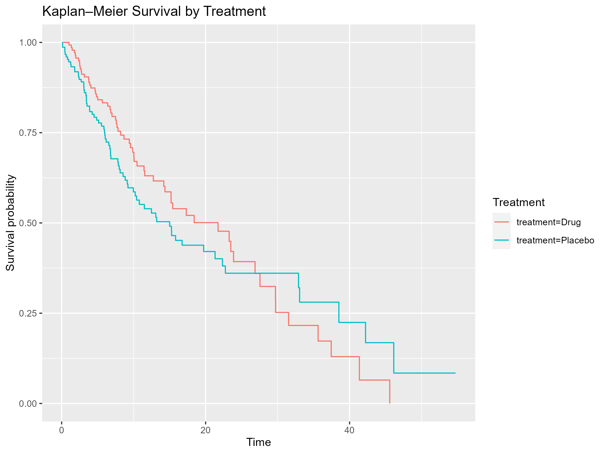
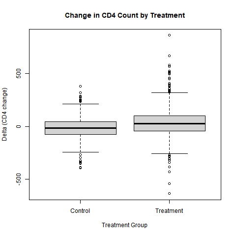
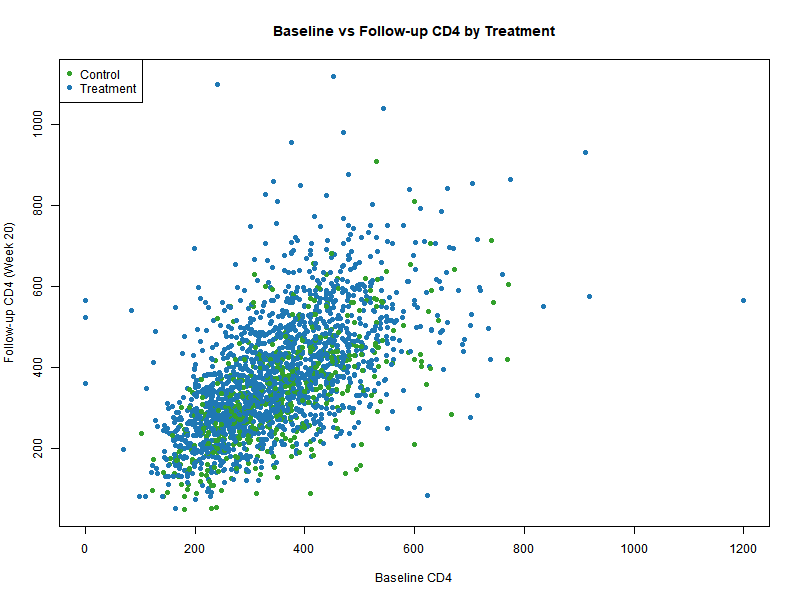
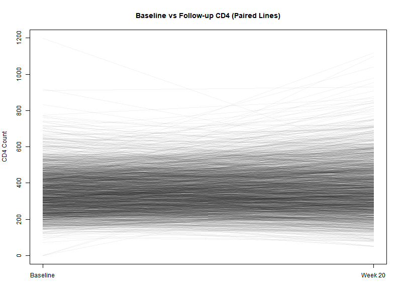

# Clinical Trial Statistical Analysis

This project explores the workflow of analyzing clinical trial data using both a simulated dataset and a real-world dataset (ACTG 175). The purpose was to understand how baseline characteristics, treatment assignment, and clinical outcomes behave across a study population. I wanted to see how much information a clinical dataset could reveal when processed through standard statistical procedures such as baseline summaries, logistic regression, and CD4 trajectory visualizations.

The simulated dataset produced neutral results with minimal separation between treatment arms. The ACTG dataset, however, generated meaningful clinical patterns, including a clear treatment effect in CD4 response.

---

# Key Outputs

## 1. Simulated Dataset: Kaplan Meier Survival Curve

Survival probability over time for the two treatment groups.

---

## 2. ACTG Baseline Characteristics

Baseline demographic and clinical characteristics stratified by treatment.

**File:** `outputs/actg_baseline_characteristics.csv`

| Characteristic                     | Control        | Treatment      | p_value |
|------------------------------------|----------------|----------------|---------|
| n                                  | 532            | 1607           |         |
| age (mean (SD))                    | 35.23 (8.85)   | 35.26 (8.66)   | 0.945   |
| sex = Male (%)                     | —              | —              | —       |
| baseline_score (mean (SD))         | 353.20 (114.11)| 349.61 (120.04)| 0.544   |
| risk_group = 1 (%)                 | 129 (24.2%)    | 383 (23.8%)    | 0.892   |

---

## 3. Logistic Regression Results (ACTG)

**File:** `outputs/actg_logistic_results.txt`

### Odds Ratios for CD4 Response

| Predictor           | OR    | 2.5%   | 97.5%  |
|--------------------|-------|--------|--------|
| Treatment          | 2.181 | 1.771  | 2.695  |
| Age                | 0.995 | 0.985  | 1.005  |
| Sex (Male vs Fem.) | 1.045 | 0.831  | 1.317  |

**Interpretation:**  
The treatment arm had more than twice the odds of achieving a positive CD4 response. Age and sex had no meaningful association with response.

---

## 4. CD4 Change Visualizations (ACTG)

### A. Delta CD4 (Boxplot)

**Description:**  
This plot shows the distribution of CD4 change from baseline to week 20. The treatment group demonstrates a higher median improvement.

---

### B. Baseline vs Follow-up CD4 Scatter

**Description:**  
Each point represents a participant. Higher follow-up CD4 values cluster more strongly in the treatment arm, showing evidence of treatment benefit.

---

### C. CD4 Paired (Spaghetti) Plot

**Description:**  
Each line shows a participant’s CD4 trajectory from baseline to week 20. Most lines trend upward, reflecting overall improvement, with more pronounced gains in treated participants.

---

# Project Purpose and Findings

### Purpose
- Simulate a small clinical trial dataset.
- Analyze a real trial dataset (ACTG 175).
- Derive clinical variables such as delta and response.
- Generate baseline tables and CD4 plots.
- Evaluate treatment effects via logistic regression.

### What I observed
- The simulated dataset showed minimal treatment differences.
- The ACTG dataset demonstrated a strong treatment effect.
- Baseline characteristics were balanced.
- Age and sex were weak predictors of response.
- CD4 trajectories confirmed improvement patterns.

### What this suggests
The ACTG dataset provides a realistic demonstration of treatment effects on immune recovery. The simulated dataset serves as a useful sandbox for understanding the analysis workflow.

### Next steps
- Add laboratory and vitals variables.
- Create additional TFL-style tables.
- Add subgroup analyses.
- Expand endpoints and longitudinal modeling.

---
